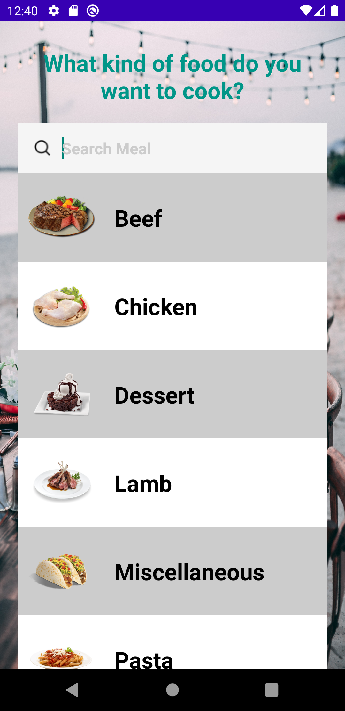
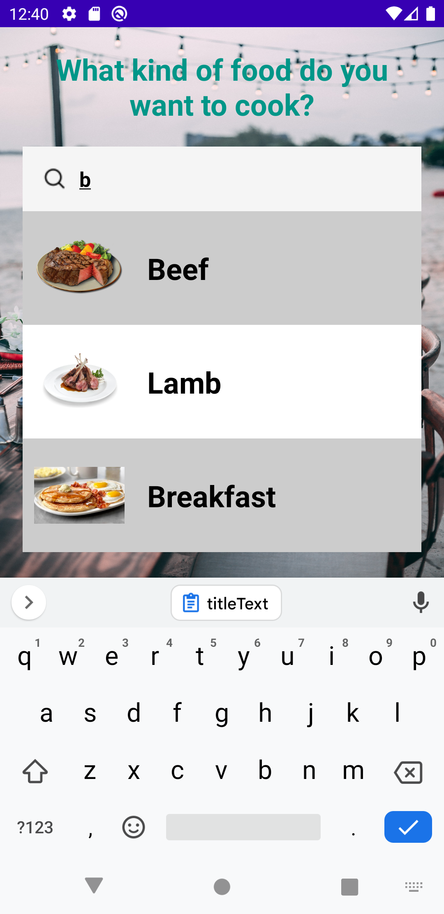
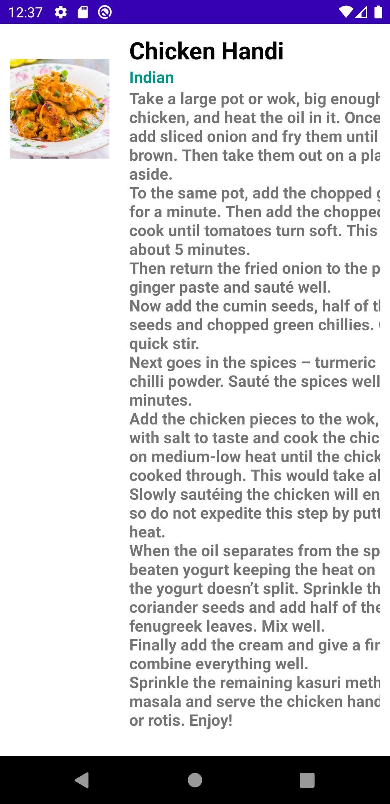

# MealApp

You can find many recipes.

# Main Page
 <dt>
  
  # You can search
 <dt>
  
  # Detail page
 <dt>

## Features

100% Kotlin <dt>
MVVM architecture <dt>
Retrofit <dt>
Android Architecture Components<dt>
ViewModel <dt>
LiveData <dt>
Data Binding <dt>
Kotlin Coroutines<dt>
Glide
